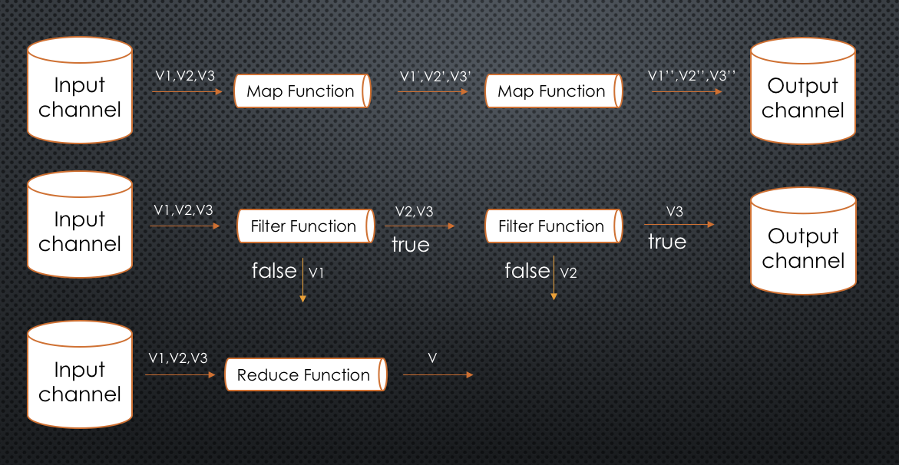

# parallel

## makes concurrency easier
Go makes concurrency easy, but the concurrency pattern is tangled with the app logic, which makes it easy to go wrong and tough to test / debug.

this lib trying to untangle concurrency logic from app logic, so it's easier to test / debug the app logic separately.

### how it works
After calling the `MapN` / `FilterN` function, it start `concurrency` of goroutines to simultaneously read from the input channel and invoke the `MapFn` / `FilterFn`, the result will be written to the output channel, if there is any error returned from the function invocation, it goes to the error channel.

for `Reduce` function, it reduces the values from input channel into a single result by calling `ReduceFn`, during the process, if there is any error, it will stop immediately and return the error to caller.



### Install
```
go get github.com/andy2046/parallel
```

### Example
the word count example creates an input channel with thousands of words, word contains space or special characters, it filter out the special characters, trim the space and title the word, then reduce it into a single word count map.

```go

var specialChar = "!@#$%^&*()"

func Example() {
	words := []string{
		"The ",
		"quick ",
		"brown",
		" fox",
		" jumps",
		"over",
		"the ",
		"lazy ",
		"dog",
		specialChar,
	}
	size := 200
	concurrency := 10
	datum := make([]string, 0, size*len(words))
	for i := 0; i < size; i++ {
		for _, w := range words {
			datum = append(datum, w)
		}
	}

	filtered, filterErrs := parallel.FilterN(concurrency, genDatum(datum...), filterSpecialCharacters)
	go func() {
		for err := range filterErrs {
			if err != nil {
				fmt.Printf("Filter error: %v", err)
			}
		}
	}()

	mapped, mapErrs := parallel.MapN(concurrency, filtered, trimTitleWords)
	go func() {
		for err := range mapErrs {
			if err != nil {
				fmt.Printf("Map error: %v", err)
			}
		}
	}()

	result, err := parallel.Reduce(mapped, count, make(map[string]int))
	if err != nil {
		fmt.Printf("Reduce error: %v", err)
	}

	for k, v := range result.(map[string]int) {
		fmt.Printf("%v:%v\n", k, v)
	}
	// Unordered output:
	// The:400
	// Quick:200
	// Brown:200
	// Fox:200
	// Jumps:200
	// Over:200
	// Lazy:200
	// Dog:200
}

func genDatum(values ...string) <-chan interface{} {
	out := make(chan interface{})
	go func() {
		defer close(out)
		for _, v := range values {
			out <- v
		}
	}()
	return out
}

func trimTitleWords(s interface{}) (interface{}, error) {
	return strings.Title(strings.TrimSpace(s.(string))), nil
}

func filterSpecialCharacters(s interface{}) (bool, error) {
	return !strings.ContainsAny(s.(string), specialChar), nil
}

func count(acc, cur interface{}) (interface{}, error) {
	m := acc.(map[string]int)
	if c, ok := m[cur.(string)]; ok {
		m[cur.(string)] = c + 1
	} else {
		m[cur.(string)] = 1
	}
	return m, nil
}

```
